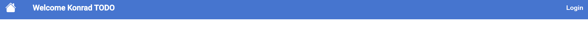
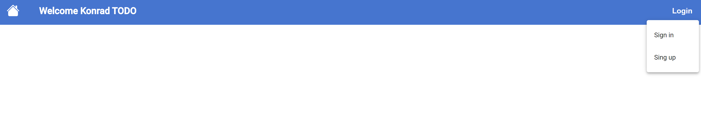
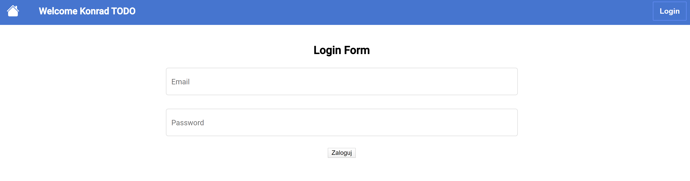

# angular_first_app
7-dni-wyzwania ze strony:  https://www.szkolaangulara.pl/angular-java-angular-dla-java-developera/

To co mi sie udało zrobić przez ostatnie 2 dni wyzwania to:
- Stworzenie własnego projektu ;) 
- Dodanie Tooltipa
- Dodanie buttona z powrotem do strony startowej
- dodanie przycisku Loguj który po zalogowaniu sie powinien zmieniac sie na Profil
- dodanie formularza do logowania

